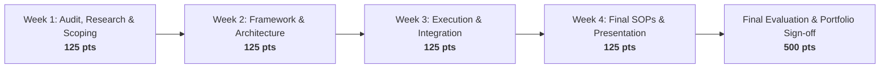

# Cortexa AI — Internship Projects Master Overview & Syllabus

**Program:** Cortexa AI Experiential Internship Capstone  
**Version:** 3.0 (Calibrated & Synchronized)  
**Standard Duration:** **4 Weeks** (All Tracks)  
**Standard Credit Award:** **500 Points** (125 Points per Weekly Milestone)  
**Total Projects:** **20 Projects** across **11 Core Domains**  
**Policy:** Single Active Enrolled Project per Intern  

---

## 1. Executive Program Architecture

The Cortexa AI Internship Portal provides structured, industry-aligned capstone tracks designed to bridge theoretical knowledge and enterprise execution. Each project follows an identical credit and evaluation framework while offering flexible technical and non-technical specializations.

### Key Program Standards
- **Uniform Duration:** Every project is calibrated to a rigorous **4-week sprint cycle** (Weeks 1 to 4).
- **Uniform Points:** Every project carries a maximum of **500 Points**. Each weekly deliverable is weighted at **125 Points**.
- **Dual Track Accessibility:**
  - **Coding & Technical Tracks:** Tailored for Software Engineering, AI/ML, and Cybersecurity candidates.
  - **No-Code, Business & Creative Tracks:** Tailored for Non-Coders, General Business, Marketing, HR, Finance, and Design candidates.
- **Single Enrolled Project Policy:** Interns may enroll in **one active capstone** at a time to ensure focused execution. Progress and submissions are saved persistently in Supabase.
- **Multi-Modal Evaluation:** Submissions are reviewed by domain leads with custom point grading (0–500 pts) and structured feedback notes. Revisions can be submitted directly from the student dashboard.

---

## 2. Master Project Directory (20 Projects)

| # | Project ID | Domain | Project Title | Difficulty | Target Audience | Duration | Points |
|---|---|---|---|---|---|---|---|
| **01** | `p_ai1` | **AI** | AI Document Knowledge Assistant & Q&A App | Intermediate | Coders / Python | 4 weeks | 500 pts |
| **02** | `p_ai2` | **AI** | AI Prompt Engineering & Chatbot Application | Beginner | Non-Coders & Tech | 4 weeks | 500 pts |
| **03** | `p_swe1` | **Software Eng.** | Full-Stack Web App with Auth & Database (CRUD) | Intermediate | Developers | 4 weeks | 500 pts |
| **04** | `p_swe2` | **Software Eng.** | Interactive Analytics Dashboard & REST API Integration | Beginner | Frontend Starters | 4 weeks | 500 pts |
| **05** | `p13` | **Software Eng.** | No-Code Business Website & AI Customer Support Chatbot | Beginner | **General / Non-Coders** | 4 weeks | 500 pts |
| **06** | `p_sec1` | **Cybersecurity** | Web Application Security Audit & OWASP Top 10 Checklist | Intermediate | Tech / Security | 4 weeks | 500 pts |
| **07** | `p_sec2` | **Cybersecurity** | Security Baseline Audit & Incident Response Playbook | Beginner | Tech / Operations | 4 weeks | 500 pts |
| **08** | `p1` | **Human Resources** | HR Talent Acquisition & Onboarding Workflow | Intermediate | Business / HR | 4 weeks | 500 pts |
| **09** | `p9` | **Human Resources** | HR Performance Management & OKR Evaluation Framework | Beginner | Business / HR | 4 weeks | 500 pts |
| **10** | `p2` | **Sales & BD** | B2B Sales Pipeline & Lead Scoring Engine | Intermediate | Sales / Analytics | 4 weeks | 500 pts |
| **11** | `p10` | **Sales & BD** | Outbound Cold Email & Lead Nurturing Campaign | Beginner | Sales / Marketing | 4 weeks | 500 pts |
| **12** | `p3` | **Marketing** | Omnichannel Digital Marketing & Campaign Strategy | Intermediate | Growth / Marketing | 4 weeks | 500 pts |
| **13** | `p11` | **Marketing** | Content Marketing Strategy & SEO Editorial Calendar | Beginner | Writers / Marketers | 4 weeks | 500 pts |
| **14** | `p14` | **Marketing** | Digital Marketing Circulation, Content Syndication & Growth | Beginner | **General / Marketing** | 4 weeks | 500 pts |
| **15** | `p4` | **Finance** | Corporate Financial Modeling & Cash Flow Forecast | Intermediate | Finance / Business | 4 weeks | 500 pts |
| **16** | `p5` | **Operations** | Supply Chain & Vendor Performance Management | Intermediate | Operations / Mgmt | 4 weeks | 500 pts |
| **17** | `p6` | **Customer Success** | Customer Retention & CSAT Health Score System | Intermediate | Operations / CS | 4 weeks | 500 pts |
| **18** | `p12` | **Customer Success** | Support SLA Architecture & Knowledge Base Optimization | Intermediate | Technical Writing / CS | 4 weeks | 500 pts |
| **19** | `p7` | **Product** | Product Go-To-Market (GTM) Strategy & Competitive Analysis | Intermediate | Product / Business | 4 weeks | 500 pts |
| **20** | `p8` | **Design** | Corporate Brand Identity & Marketing Design System | Intermediate | UI/UX / Creatives | 4 weeks | 500 pts |

---

## 3. Universal 4-Week Milestone Framework

All 20 projects adhere to a structured 4-week agile roadmap. Regardless of technical complexity, every intern follows this phased progression:



- **Week 1: Research, Audit & Scoping (125 pts)**
  - Baseline audit of problem statements, user requirements, and existing market benchmarks.
  - Setup of environment, tools, and technical/operational scoping documents.
- **Week 2: Architecture & Workflow Design (125 pts)**
  - Structural modeling: ERD schemas, workflow pipelines, wireframes, or strategy templates.
  - Mid-stage testing against sample data or dummy scenarios.
- **Week 3: Execution, Tooling & Pilot Implementation (125 pts)**
  - Core build phase: Code implementation, no-code integrations, or live campaign simulations.
  - Quality assurance testing, deliverability checks, and bug triage.
- **Week 4: Final Implementation, SOPs, Demo Video & Presentation (125 pts)**
  - Final polish and packaging of all live deliverables into a portfolio-ready case study.
  - 3–5 minute Loom demo video and executive summary deck for domain mentor sign-off.

---

## 4. Comprehensive Project Overviews (Detailed Profiles)

---

### Domain 1: Artificial Intelligence (AI)

#### Project 01: AI Document Knowledge Assistant & Q&A App
- **Project ID:** `p_ai1`
- **Track & Audience:** Technical / Software & AI Students (Python Required)
- **Difficulty:** Intermediate | **Duration:** 4 weeks | **Points:** 500
- **Team Size:** 1–2 Interns
- **Overview:** Build a full-featured Retrieval-Augmented Generation (RAG) assistant using LangChain, OpenAI APIs, and vector databases (FAISS/Chroma) capable of ingesting enterprise product manuals and answering user queries with verified citations.
- **Tech Stack:** Python, LangChain, OpenAI API, FAISS / Chroma Vector Store, Streamlit.
- **Learning Outcomes:** RAG pipeline architecture, text chunking & embedding strategies, vector similarity indexing, hallucination mitigation, interactive Streamlit UI.
- **Real-World Case Study:** *Acme Cloud Intelligence* — SaaS company with 200+ internal markdown technical docs where employees waste 15+ hours weekly searching for documentation answers.
- **Weekly Milestones:**
  - **Week 1 (125 pts):** Ingestion pipeline setup, document chunking & token counting analysis.
  - **Week 2 (125 pts):** Vector database embedding index & similarity search retrieval benchmarking.
  - **Week 3 (125 pts):** LLM integration, prompt template customization & citation verification logic.
  - **Week 4 (125 pts):** Streamlit UI deployment, response latency optimization (<2s), and executive demo video.
- **Core Deliverables:** GitHub repository, live Streamlit application link, architectural case study document, 3-min Loom demo.

---

#### Project 02: AI Prompt Engineering & Chatbot Application
- **Project ID:** `p_ai2`
- **Track & Audience:** Accessible to Non-Coders & Introductory Coders
- **Difficulty:** Beginner | **Duration:** 4 weeks | **Points:** 500
- **Team Size:** 1 Intern
- **Overview:** Design sophisticated prompt templates, system instructions, and multi-turn conversational agents using OpenAI APIs or playground environments. Develop an automated prompt evaluation matrix to benchmark accuracy, tone, and guardrails.
- **Tech Stack:** Python, OpenAI API / Playground, Streamlit / Gradio, JSON, Prompt Template Matrices.
- **Learning Outcomes:** System vs User prompt engineering, few-shot prompting, chain-of-thought prompting, hallucination benchmarking, conversational state management.
- **Real-World Case Study:** *Apex Customer Care* — High-volume support desk needing an automated AI triage assistant to categorize customer tickets and draft contextual responses without hallucinations.
- **Weekly Milestones:**
  - **Week 1 (125 pts):** Persona definitions, user intents catalog & system prompt design.
  - **Week 2 (125 pts):** Multi-turn conversation handling, prompt testing sandbox & edge-case catalog.
  - **Week 3 (125 pts):** Quantitative prompt evaluation matrix (scoring accuracy, tone, latency, safety).
  - **Week 4 (125 pts):** Interactive chatbot prototype, prompt library documentation & executive presentation.
- **Core Deliverables:** Prompt template library (JSON/Markdown), evaluation scorecard spreadsheet, interactive demo app, video walkthrough.

---

### Domain 2: Software Engineering & Web Development (SWE)

#### Project 03: Full-Stack Web App with Auth & Database (CRUD)
- **Project ID:** `p_swe1`
- **Track & Audience:** Web Developers / Full-Stack Engineers
- **Difficulty:** Intermediate | **Duration:** 4 weeks | **Points:** 500
- **Team Size:** 1–2 Interns
- **Overview:** Architect and deploy an end-to-end web application with secure user authentication, role-based access control (RBAC), relational database schemas, and structured RESTful API endpoints.
- **Tech Stack:** Next.js / React, Node.js / Express, Supabase / PostgreSQL, TailwindCSS, TypeScript.
- **Learning Outcomes:** Full-stack CRUD architecture, relational data modeling, JWT/OAuth authentication, protected client and server routes, deployment workflows.
- **Real-World Case Study:** *PayPulse Fintech* — Financial operations team operating on manual spreadsheets without data audit logs, requiring an authenticated internal portal for transaction audits.
- **Weekly Milestones:**
  - **Week 1 (125 pts):** Relational schema design (ERD), API contract specification & Next.js starter setup.
  - **Week 2 (125 pts):** Supabase database migrations, Row-Level Security (RLS) policies & authentication flow.
  - **Week 3 (125 pts):** CRUD API routes, state management, form validation & error boundary handling.
  - **Week 4 (125 pts):** Cloud deployment (Vercel), responsive UI polish, API test suite & recorded demonstration.
- **Core Deliverables:** Public GitHub repo with CI/CD, live deployed URL, Postman API collection, architectural documentation.

---

#### Project 04: Interactive Analytics Dashboard & REST API Integration
- **Project ID:** `p_swe2`
- **Track & Audience:** Frontend Engineers & Junior Developers
- **Difficulty:** Beginner | **Duration:** 4 weeks | **Points:** 500
- **Team Size:** 1 Intern
- **Overview:** Build a responsive, high-performance data dashboard that consumes public or simulated REST APIs, transforms JSON payloads, and visualizes complex business metrics with charts, filtering, and dark/light mode toggles.
- **Tech Stack:** React / Next.js, TailwindCSS, Recharts / Chart.js, Axios, TypeScript.
- **Learning Outcomes:** Async API data fetching, loading/empty states, component modularity, interactive data visualizations, responsive grid layout.
- **Real-World Case Study:** *MetricScale Analytics* — Business intelligence firm needing an executive dashboard to monitor server uptime, user traffic, and conversion funnels across global regions.
- **Weekly Milestones:**
  - **Week 1 (125 pts):** UI component wireframing, API endpoint discovery & data contract modeling.
  - **Week 2 (125 pts):** Dashboard shell implementation, navigation, and reusable KPI card components.
  - **Week 3 (125 pts):** Recharts integration (line, bar, pie), time-range filters, and search indexing.
  - **Week 4 (125 pts):** Responsive layout optimization, performance tuning, and executive presentation.
- **Core Deliverables:** Deployed web application, GitHub repository with clean commit history, dashboard user manual.

---

#### Project 05: No-Code Business Website & AI Customer Support Chatbot
- **Project ID:** `p13`
- **Track & Audience:** **General Students, Non-Coders & Cross-Functional Interns**
- **Difficulty:** Beginner | **Duration:** 4 weeks | **Points:** 500
- **Team Size:** 1 Intern
- **Overview:** Build a modern, conversion-optimized business website using no-code platforms (Framer, Webflow, or WordPress) and embed an intelligent 24/7 AI customer service chatbot (Voiceflow, Chatbase, or Tidio) trained on custom business knowledge.
- **Tech Stack:** Framer / Webflow / WordPress, Voiceflow / Chatbase / Tidio, HTML/Script Embeds, Lead Webhooks, Google Analytics 4.
- **Learning Outcomes:** Responsive visual design, AI knowledge base training, third-party embed integrations, lead generation webhooks, SEO meta tagging.
- **Real-World Case Study:** *Solaria Health & Wellness* — Rapidly growing wellness clinic losing potential clients after business hours due to lack of a responsive booking site and instant Q&A answers.
- **Weekly Milestones:**
  - **Week 1 (125 pts):** Business scope document, site map wireframing & knowledge base Q&A compilation.
  - **Week 2 (125 pts):** No-code website build (Hero, Services, Testimonials, Contact) with mobile responsiveness.
  - **Week 3 (125 pts):** AI chatbot training on business FAQs, escalation triggers, and widget embedding.
  - **Week 4 (125 pts):** Lead capture webhook integration (Zapier/Email), SEO audit, and recorded video showcase.
- **Core Deliverables:** Live public website URL with working AI chatbot, FAQ knowledge base document, lead automation proof, 3-min walkthrough.

---

### Domain 3: Cybersecurity & Information Security (Cybersecurity)

#### Project 06: Web Application Security Audit & OWASP Top 10 Checklist
- **Project ID:** `p_sec1`
- **Track & Audience:** Security Engineers & Technical IT Students
- **Difficulty:** Intermediate | **Duration:** 4 weeks | **Points:** 500
- **Team Size:** 1–2 Interns
- **Overview:** Conduct an in-depth security posture assessment on a mock enterprise web application using OWASP ZAP and DevTools, identifying vulnerabilities (SQLi, XSS, Broken Auth) and authoring practical remediation patches.
- **Tech Stack:** OWASP ZAP, Browser DevTools, HTTP Security Headers, CVSS v3.1 Scoring, Postman.
- **Learning Outcomes:** Vulnerability scanning, CVSS risk severity scoring, vulnerability remediation coding, security audit reporting.
- **Real-World Case Study:** *HealthTech Connect* — Telehealth startup preparing for SOC2/HIPAA compliance requiring an audit of public endpoints and authentication barriers.
- **Weekly Milestones:**
  - **Week 1 (125 pts):** Scope definition, threat modeling & initial automated scanner baseline.
  - **Week 2 (125 pts):** OWASP Top 10 vulnerability inspection (injection, authentication, sensitive data exposure).
  - **Week 3 (125 pts):** CVSS vulnerability scoring, proof-of-concept replication & remediation patch drafting.
  - **Week 4 (125 pts):** Formal Security Audit Report, executive vulnerability summary, and remediation SOP.
- **Core Deliverables:** Comprehensive Security Audit Report (PDF/Markdown), vulnerability matrix with CVSS scores, remediation code snippets.

---

#### Project 07: Security Baseline Audit & Incident Response Playbook
- **Project ID:** `p_sec2`
- **Track & Audience:** IT Support, System Admin & Security Starters
- **Difficulty:** Beginner | **Duration:** 4 weeks | **Points:** 500
- **Team Size:** 1 Intern
- **Overview:** Evaluate enterprise access control configurations, audit simulated system authentication logs for unauthorized activity, and construct an actionable Incident Response (IR) Playbook for credential compromise and phishing attacks.
- **Tech Stack:** Access Control Matrix (RBAC), Event Log Analysis, NIST Cybersecurity Framework, Incident Playbooks.
- **Learning Outcomes:** Principle of least privilege auditing, security event log interpretation, incident triage & containment workflows, security compliance documentation.
- **Real-World Case Study:** *FinLeap Advisory* — Financial consulting firm experiencing suspicious login spikes and needing an ironclad incident protocol for employees.
- **Weekly Milestones:**
  - **Week 1 (125 pts):** Access control baseline audit, role privilege mapping & gap identification.
  - **Week 2 (125 pts):** Security event log analysis (identifying brute force, anomalous geographic logins).
  - **Week 3 (125 pts):** Step-by-step Incident Response Playbook for phishing and unauthorized credential access.
  - **Week 4 (125 pts):** Employee security onboarding SOP, tabletop exercise scenario & executive presentation.
- **Core Deliverables:** Access Control Gap Matrix, Phishing & Account Compromise IR Playbook, tabletop simulation report.

---

### Domain 4: Human Resources & Talent Operations (HR)

#### Project 08: HR Talent Acquisition & Onboarding Workflow
- **Project ID:** `p1`
- **Track & Audience:** HR, People Operations & Business Students
- **Difficulty:** Intermediate | **Duration:** 4 weeks | **Points:** 500
- **Team Size:** 1–2 Interns
- **Overview:** Design and deploy an end-to-end recruitment funnel, structured 30-60-90 day employee onboarding journey, automated check-in cadences, and onboarding SLA tracking dashboards for a distributed workforce.
- **Tech Stack:** Notion / Airtable, Google Workspace, HRIS Process Mapping, Typeform.
- **Learning Outcomes:** Recruitment pipeline modeling, onboarding SLA design, remote employee retention strategies, HR operational KPIs.
- **Real-World Case Study:** *Nova Workflows* — 50-person remote tech startup experiencing a 24% 90-day new-hire churn rate due to fragmented onboarding materials.
- **Weekly Milestones:**
  - **Week 1 (125 pts):** Candidate persona profiling, recruitment rubric & job description templates.
  - **Week 2 (125 pts):** Interactive 30-60-90 Day Employee Onboarding Hub in Notion/Sheets.
  - **Week 3 (125 pts):** Automated check-in templates, buddy system rubrics & feedback survey forms.
  - **Week 4 (125 pts):** HR Manager SOP document, onboarding metrics scorecard & executive walkthrough.
- **Core Deliverables:** Interactive Notion/Airtable Onboarding Portal, 30-60-90 day roadmap, HR Manager SOP.

---

#### Project 09: HR Performance Management & OKR Evaluation Framework
- **Project ID:** `p9`
- **Track & Audience:** HR & Management Students
- **Difficulty:** Beginner | **Duration:** 4 weeks | **Points:** 500
- **Team Size:** 1 Intern
- **Overview:** Establish a quarterly OKR (Objectives & Key Results) tracking framework, employee self-appraisal rubrics, and a balanced 360-degree feedback evaluation process to eliminate subjective performance reviews.
- **Tech Stack:** Google Sheets, OKR Frameworks, Performance Appraisal Rubrics, Survey Design.
- **Learning Outcomes:** Objective goal setting methodology, performance review rubric design, 360-degree feedback synthesis, employee development planning.
- **Real-World Case Study:** *ClearPath Media* — Fast-growing agency where lack of objective review rubrics led to employee dissatisfaction and unclear promotion criteria.
- **Weekly Milestones:**
  - **Week 1 (125 pts):** Company OKR architecture & department-level goal cascading templates.
  - **Week 2 (125 pts):** Performance appraisal rubric (Competency, Impact, Culture) in Google Sheets.
  - **Week 3 (125 pts):** 360-degree feedback collection forms and peer evaluation workflows.
  - **Week 4 (125 pts):** Performance Improvement Plan (PIP) SOP, manager review guidelines & final deck.
- **Core Deliverables:** Live OKR & Review Tracker spreadsheet, 360-degree feedback templates, HR Manager Performance Guide.

---

### Domain 5: Sales & Business Development (Sales)

#### Project 10: B2B Sales Pipeline & Lead Scoring Engine
- **Project ID:** `p2`
- **Track & Audience:** Sales, Business Development & Analytics Students
- **Difficulty:** Intermediate | **Duration:** 4 weeks | **Points:** 500
- **Team Size:** 1–2 Interns
- **Overview:** Build an algorithmic lead scoring engine and B2B pipeline stage tracking system that classifies incoming leads into Hot, Warm, and Cold tiers based on firmographic and behavioral intent signals.
- **Tech Stack:** Google Sheets / Excel, HubSpot CRM, Zapier / Make, B2B Sales Cadences.
- **Learning Outcomes:** Quantitative lead scoring models, sales stage velocity optimization, CRM pipeline automation, conversion analytics.
- **Real-World Case Study:** *Apex B2B Solutions* — Sales representatives wasting 65% of their prospecting time on unqualified leads, leading to missed quarterly revenue goals.
- **Weekly Milestones:**
  - **Week 1 (125 pts):** Ideal Customer Profile (ICP) definition and quantitative lead scoring matrix.
  - **Week 2 (125 pts):** Dynamic lead scoring model in Google Sheets with weighted scoring formulas.
  - **Week 3 (125 pts):** CRM pipeline stage definition, SLA response rules & automated routing workflows.
  - **Week 4 (125 pts):** Sales playbook documentation, objections handling guide & executive pitch video.
- **Core Deliverables:** Interactive Lead Scoring Model spreadsheet, B2B Sales Pipeline SOP, 5-stage outreach sequence.

---

#### Project 11: Outbound Cold Email & Lead Nurturing Campaign
- **Project ID:** `p10`
- **Track & Audience:** Sales & Growth Starters
- **Difficulty:** Beginner | **Duration:** 4 weeks | **Points:** 500
- **Team Size:** 1 Intern
- **Overview:** Write high-converting outbound cold email copy, configure email deliverability standards (SPF, DKIM, DMARC), structure a 4-touchpoint nurture sequence, and analyze response rate conversions.
- **Tech Stack:** Cold Email Copywriting, Apollo.io / Instantly, Mailchimp / HubSpot, A/B Testing Frameworks.
- **Learning Outcomes:** Cold email copywriting, spam trigger avoidance, domain deliverability setup, A/B testing methodology, pipeline generation tracking.
- **Real-World Case Study:** *SaaSScale Ventures* — B2B software tool struggling to book discovery calls through generic cold outreach with open rates below 12%.
- **Weekly Milestones:**
  - **Week 1 (125 pts):** Target prospect segment research, pain-point analysis & value proposition messaging.
  - **Week 2 (125 pts):** 4-step cold email nurture sequence with personalized merge tag variables.
  - **Week 3 (125 pts):** A/B subject line experiment framework and technical deliverability checklist.
  - **Week 4 (125 pts):** Response handling objection playbook, campaign analytics tracker & final presentation.
- **Core Deliverables:** Complete 4-step email sequence copy, A/B test analysis matrix, Technical Deliverability Guide.

---

### Domain 6: Digital Marketing & Content Strategy (Marketing)

#### Project 12: Omnichannel Digital Marketing & Campaign Strategy
- **Project ID:** `p3`
- **Track & Audience:** Digital Marketers & Growth Strategists
- **Difficulty:** Intermediate | **Duration:** 4 weeks | **Points:** 500
- **Team Size:** 1–2 Interns
- **Overview:** Develop a comprehensive cross-channel acquisition campaign across Google Search, Meta Ads, and Email marketing, featuring full UTM attribution tracking, budget allocation models, and Looker Studio dashboards.
- **Tech Stack:** Meta Ads Manager, Google Ads, Looker Studio, Google Analytics 4, Canva.
- **Learning Outcomes:** Omnichannel campaign budgeting, CAC & ROAS modeling, UTM tracking taxonomy, visual reporting dashboards, conversion rate optimization.
- **Real-World Case Study:** *Lumina Consumer Brand* — E-commerce brand experiencing rising customer acquisition costs (CAC +35%) due to lack of channel attribution.
- **Weekly Milestones:**
  - **Week 1 (125 pts):** Audience persona definition, competitor ad teardown & budget allocation model ($10k spend).
  - **Week 2 (125 pts):** Ad copy matrix (Search, Meta carousels, video script hooks) and landing page wireframe.
  - **Week 3 (125 pts):** UTM parameter tracking taxonomy and live Looker Studio reporting dashboard.
  - **Week 4 (125 pts):** Comprehensive Campaign Master Deck, campaign launch SOP, and executive walkthrough.
- **Core Deliverables:** Omnichannel Marketing Strategy Deck, Looker Studio Dashboard, Ad Copy Asset Library.

---

#### Project 13: Content Marketing Strategy & SEO Editorial Calendar
- **Project ID:** `p11`
- **Track & Audience:** Content Writers & SEO Specialists
- **Difficulty:** Beginner | **Duration:** 4 weeks | **Points:** 500
- **Team Size:** 1 Intern
- **Overview:** Conduct high-intent SEO keyword research, design a 3-month topic cluster strategy, write search-optimized pillar content, and establish tracking benchmarks in Google Search Console.
- **Tech Stack:** Google Keyword Planner, Ahrefs / Ubersuggest, WordPress / Notion, Google Search Console.
- **Learning Outcomes:** Search intent classification, keyword difficulty analysis, pillar-cluster content modeling, on-page SEO optimization, editorial scheduling.
- **Real-World Case Study:** *FinEdutech Hub* — Educational platform reliant purely on paid ads, seeking sustainable organic search traffic for financial literacy topics.
- **Weekly Milestones:**
  - **Week 1 (125 pts):** Keyword research matrix (100+ keywords classified by search intent and volume).
  - **Week 2 (125 pts):** 3-month topic cluster architecture and editorial calendar schedule.
  - **Week 3 (125 pts):** 2,000-word SEO-optimized pillar blog article with headers, internal links & meta tags.
  - **Week 4 (125 pts):** Content repurposing framework (social snippets), SEO checklist SOP & presentation.
- **Core Deliverables:** 100-Keyword SEO Matrix, 3-Month Editorial Calendar, Full Pillar Article, On-Page SEO SOP.

---

#### Project 14: Digital Marketing Circulation, Content Syndication & Growth Engine
- **Project ID:** `p14`
- **Track & Audience:** **General Students, Content Creators & Marketers**
- **Difficulty:** Beginner | **Duration:** 4 weeks | **Points:** 500
- **Team Size:** 1 Intern
- **Overview:** Build and execute an organic content circulation and distribution engine that repurposes high-value core insights into multi-platform formats (LinkedIn carousels, X threads, short-form video hooks, and email newsletters) to maximize circulation reach, referral loops, and subscriber acquisition.
- **Tech Stack:** Content Syndication Frameworks, Substack / Mailchimp, Buffer / Publer, Canva / CapCut, GA4 & Social Analytics.
- **Learning Outcomes:** 1-to-many content repurposing workflows, viral hook copywriting, email subscriber acquisition strategies, cross-channel engagement tracking, organic referral loops.
- **Real-World Case Study:** *VentureInsights Media* — Research publication producing in-depth reports that receive low views due to a bottleneck in social distribution and newsletter syndication.
- **Weekly Milestones:**
  - **Week 1 (125 pts):** Core insight selection, audience distribution channel audit & circulation workflow blueprint.
  - **Week 2 (125 pts):** Multi-format asset creation: 10-slide LinkedIn carousel, 8-tweet viral thread, 2 short-form video scripts.
  - **Week 3 (125 pts):** Email newsletter edition design (Substack/Mailchimp) with lead-magnet referral CTA.
  - **Week 4 (125 pts):** Social scheduling calendar (30 days), circulation performance dashboard & syndication SOP.
- **Core Deliverables:** Multi-Platform Asset Kit (Carousels, Threads, Scripts), Live Newsletter Issue, 30-Day Circulation Calendar, Syndication SOP.

---

### Domain 7: Corporate Finance & Financial Modeling (Finance)

#### Project 15: Corporate Financial Modeling & Cash Flow Forecast
- **Project ID:** `p4`
- **Track & Audience:** Finance, Accounting & Business Analytics Students
- **Difficulty:** Intermediate | **Duration:** 4 weeks | **Points:** 500
- **Team Size:** 1–2 Interns
- **Overview:** Build a dynamic 3-statement financial model (Income Statement, Balance Sheet, Cash Flow) with dynamic revenue drivers, scenario toggles (Base, Bull, Bear), and monthly runway sensitivity analysis.
- **Tech Stack:** Microsoft Excel / Google Sheets, Financial Modeling Formulas, Scenario Managers.
- **Learning Outcomes:** Integrated 3-statement modeling, working capital calculation, DCF / IRR fundamentals, scenario sensitivity analysis, CFO presentation charting.
- **Real-World Case Study:** *Vanguard Logistics* — Mid-market logistics firm lacking visibility into monthly cash burn and runway under fluctuating fuel and warehouse expenses.
- **Weekly Milestones:**
  - **Week 1 (125 pts):** Historical data normalization, chart of accounts setup & revenue driver assumptions.
  - **Week 2 (125 pts):** Income Statement and Balance Sheet dynamic modeling with debt and depreciation schedules.
  - **Week 3 (125 pts):** Integrated Cash Flow Statement, monthly runway calculator & scenario toggle switches.
  - **Week 4 (125 pts):** Sensitivity analysis tables (pricing vs volume), executive summary charts & CFO pitch video.
- **Core Deliverables:** Dynamic Excel/Sheets Financial Model, Executive Financial Summary Deck, Model User Guide.

---

### Domain 8: Operations & Supply Chain (Operations)

#### Project 16: Supply Chain & Vendor Performance Management
- **Project ID:** `p5`
- **Track & Audience:** Operations, Industrial Engineering & Supply Chain Students
- **Difficulty:** Intermediate | **Duration:** 4 weeks | **Points:** 500
- **Team Size:** 1–2 Interns
- **Overview:** Design an operational vendor scorecading system, safety stock reorder calculator, and distribution bottleneck audit framework to reduce supplier fulfillment delays and warehouse stockouts.
- **Tech Stack:** Google Sheets, Process Flow Diagrams (Lucidchart), Inventory Formulas (EOQ, ROP), SLA Matrices.
- **Learning Outcomes:** Vendor SLA evaluation, Economic Order Quantity (EOQ) calculation, reorder point (ROP) modeling, supply chain bottleneck identification.
- **Real-World Case Study:** *Nexus Global Supply Chain* — E-commerce distributor experiencing 18-day average supplier delivery delays and a 12% warehouse stockout rate.
- **Weekly Milestones:**
  - **Week 1 (125 pts):** Supplier fulfillment audit, current process map & pain point bottleneck analysis.
  - **Week 2 (125 pts):** Weighted Vendor SLA Scorecard (measuring On-Time In-Full, quality defect rates, pricing).
  - **Week 3 (125 pts):** Dynamic Safety Stock & Reorder Point (ROP) calculator with lead time variance formulas.
  - **Week 4 (125 pts):** Supplier Escalation SOP, quarterly vendor review templates & presentation.
- **Core Deliverables:** Vendor Scorecard Model, Inventory Optimization Calculator, Operational SLA SOP.

---

### Domain 9: Customer Success & Support Operations (Customer Success)

#### Project 17: Customer Retention & CSAT Health Score System
- **Project ID:** `p6`
- **Track & Audience:** Customer Success, Operations & Client Service Students
- **Difficulty:** Intermediate | **Duration:** 4 weeks | **Points:** 500
- **Team Size:** 1–2 Interns
- **Overview:** Build a predictive Customer Health Scoring engine that evaluates product adoption, support ticket sentiment, and survey feedback to proactively identify and rescue at-risk accounts before contract renewal.
- **Tech Stack:** Google Sheets / Airtable, CSAT / NPS Survey Engines, Customer Journey Mapping.
- **Learning Outcomes:** Customer health score algorithms, churn risk factor modeling, NPS survey automation, proactive customer intervention playbooks.
- **Real-World Case Study:** *CloudPulse Enterprise Software* — B2B enterprise software with annual churn rising to 9.2% due to lack of early indicators for disengaged accounts.
- **Weekly Milestones:**
  - **Week 1 (125 pts):** Churn autopsy analysis, customer health score criteria & weighting framework.
  - **Week 2 (125 pts):** Dynamic Customer Health Model (Green/Amber/Red tiers) with automated alerts.
  - **Week 3 (125 pts):** Customer Success Playbook for at-risk accounts and automated onboarding cadences.
  - **Week 4 (125 pts):** CSAT/NPS survey integration guide, executive retention dashboard & final walkthrough.
- **Core Deliverables:** Customer Health Score Model, At-Risk Account Playbook, Executive Retention Deck.

---

#### Project 18: Support SLA Architecture & Knowledge Base Optimization
- **Project ID:** `p12`
- **Track & Audience:** Customer Support Specialists & Technical Writers
- **Difficulty:** Intermediate | **Duration:** 4 weeks | **Points:** 500
- **Team Size:** 1–2 Interns
- **Overview:** Rearchitect customer support ticket escalation tiers, author 20+ standardized self-service help center articles, and establish support workflows to cut First Response Time (FRT) by 40%.
- **Tech Stack:** Helpdesk Frameworks (Zendesk / Intercom / Notion), Technical Writing, Ticket SLA Matrices.
- **Learning Outcomes:** SLA tiering & escalation triggers, knowledge base taxonomy design, technical documentation writing, support metrics analytics.
- **Real-World Case Study:** *SwiftApp Solutions* — High ticket volume overwhelming tier-1 support agents with repetitive questions that lack public documentation.
- **Weekly Milestones:**
  - **Week 1 (125 pts):** Ticket volume analysis, categorization taxonomy & SLA tier definition (P1–P4).
  - **Week 2 (125 pts):** Escalation workflow diagram and macro response templates for support agents.
  - **Week 3 (125 pts):** 10 detailed self-service Knowledge Base articles following structured user documentation styles.
  - **Week 4 (125 pts):** Support Operations SOP, First Response Time (FRT) scorecard & final presentation.
- **Core Deliverables:** Support SLA & Escalation Matrix, Knowledge Base Article Suite (Markdown/Notion), Support Ops SOP.

---

### Domain 10: Product Management (Product)

#### Project 19: Product Go-To-Market (GTM) Strategy & Competitive Analysis
- **Project ID:** `p7`
- **Track & Audience:** Product Managers, Strategists & Business Analysts
- **Difficulty:** Intermediate | **Duration:** 4 weeks | **Points:** 500
- **Team Size:** 1–2 Interns
- **Overview:** Formulate a comprehensive Product Go-To-Market (GTM) strategy for a new B2B feature, including competitive feature tear downs, RICE feature prioritization, pricing models, and user onboarding flow wireframes.
- **Tech Stack:** Figma / Miro, RICE Prioritization Frameworks, Competitive Intelligence Matrices, Notion.
- **Learning Outcomes:** Market competitor benchmarking, RICE scoring, product positioning & messaging, GTM launch checklists, user journey mapping.
- **Real-World Case Study:** *SaaSFlow Platform* — Product leadership preparing to launch an AI workflow automation add-on without clear competitor differentiation or pricing tiers.
- **Weekly Milestones:**
  - **Week 1 (125 pts):** Competitive intelligence matrix (benchmarking 5 competitors on features, pricing, UX).
  - **Week 2 (125 pts):** User persona definitions, jobs-to-be-done (JTBD) & RICE feature prioritization.
  - **Week 3 (125 pts):** Pricing & packaging strategy (Freemium vs Tiered) and product onboarding wireframes.
  - **Week 4 (125 pts):** GTM Launch Playbook (marketing, sales enablement, support alignment) and executive pitch deck.
- **Core Deliverables:** Competitive Intelligence Matrix, GTM Strategy Pitch Deck, RICE Prioritization Model, Onboarding Wireframes.

---

### Domain 11: UI/UX & Brand Design (Design)

#### Project 20: Corporate Brand Identity & Marketing Design System
- **Project ID:** `p8`
- **Track & Audience:** UI/UX Designers, Graphic Designers & Visual Creatives
- **Difficulty:** Intermediate | **Duration:** 4 weeks | **Points:** 500
- **Team Size:** 1–2 Interns
- **Overview:** Create an enterprise brand design system in Figma, complete with typography hierarchy, WCAG 2.1 AA compliant color tokens, reusable UI component libraries, and social marketing promotional templates.
- **Tech Stack:** Figma, Design Tokens, WCAG Color Contrast Checkers, Component Auto-Layout.
- **Learning Outcomes:** Design system architecture, accessibility & color contrast compliance, responsive UI component variants, brand guideline documentation.
- **Real-World Case Study:** *Aura Fintech & Payments* — Growing fintech startup facing fragmented brand visuals, inconsistent font sizes, and unaccessible contrast across web and mobile.
- **Weekly Milestones:**
  - **Week 1 (125 pts):** Brand audit, moodboard curation, typography hierarchy & accessible color tokens.
  - **Week 2 (125 pts):** Core UI component library in Figma (Buttons, Form Inputs, Badges, Modals) with Auto-Layout.
  - **Week 3 (125 pts):** Marketing design templates (social media carousels, ad banners, pitch deck master slides).
  - **Week 4 (125 pts):** Brand Style Guide Handbook (PDF/Figma), design token documentation & recorded walkthrough.
- **Core Deliverables:** Master Figma File with Component Library, WCAG Compliance Report, Brand Guidelines Book.

---

## 5. Submission & Evaluation Workflow

Interns complete their capstones by submitting weekly deliverables directly inside the portal:

```
[Intern Enrolls in 1 Project]
           │
           ▼
[Week 1 Submission (125 pts)] ───► [Admin / Mentor Review & Notes]
           │
           ▼
[Week 2 Submission (125 pts)] ───► [Admin / Mentor Review & Notes]
           │
           ▼
[Week 3 Submission (125 pts)] ───► [Admin / Mentor Review & Notes]
           │
           ▼
[Week 4 Submission (125 pts)] ───► [Final Presentation & Total Evaluation]
           │
           ▼
[Full 500-Point Credential Awarded & Certificate Generated]
```

### Evaluation Rubric (125 Points per Week)
- **Technical / Functional Rigor (40 pts):** Completeness and execution quality of code, model, or strategy.
- **Problem-Solving & Depth (35 pts):** Practical resolution of the case study target problem.
- **Documentation & Polish (25 pts):** Clarity of SOPs, READMEs, and structured deliverables.
- **Presentation & Video Walkthrough (25 pts):** Professionalism of the Loom walkthrough and executive deck.

---

## 6. Custom Student Project Proposals

Interns with specialized domain interests or unique startup ideas can propose a custom capstone via the **"Propose Custom Project"** drawer in the student portal.

1. **Submission:** Intern submits project title, problem statement, domain, and proposed tools.
2. **Mentor Review:** Admin mentors review proposal scope, refine milestones, and calibrate to standard **4 weeks & 500 points**.
3. **Activation:** Once approved, the project is instantly added to the student's active dashboard and logged in the enterprise catalog.
